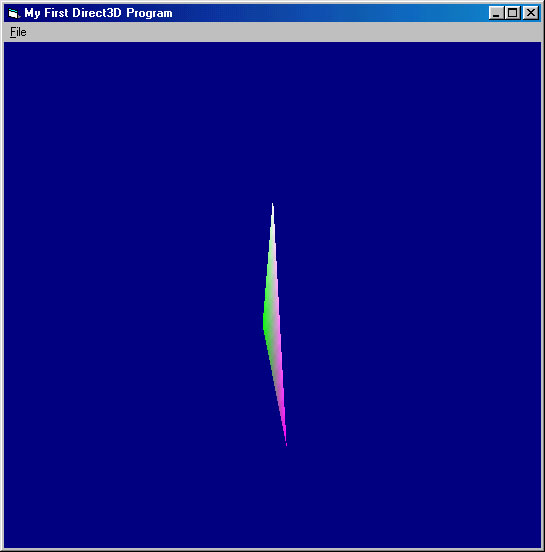



## Direct3D with DirectX 8\.1 Tutorial 1

### Description

This is a tutorial that I decided to put up here. I'm currently reading "Special Effects Game Programming with DirectX" by Mason McCuskey, and I decided that, while tackling the C++ code in the book, to also try and do conversions of the examples into VB, because I know there is next to nothing in book form on DX 8.1 with Visual Basic. So, I am giving this to the community. Beware, this code is HEAVILY COMMENTED so beginners can get a big benefit out of this. I spent about 2 weeks sifting through C++ code and such to get this just right so it works just like its C++ cousin, in some parts even better. I tried to explain each DX function as best as possible, but if you are still scratching your head, contact me and I'll try to answer your questions.
 
### More Info
 
A better beginning knowledge of Direct3D.

Your video card may produce slightly different results or nothing at all. Contact me if you have problems.

             |
---                |---
**Submitted On**   |2002-03-26 00:57:12
**By**             |[Devin Watson](https://github.com/Planet-Source-Code/PSCIndex/blob/master/ByAuthor/devin-watson.md)
**Level**          |Beginner
**User Rating**    |5.0 (15 globes from 3 users)
**Compatibility**  |VB 6\.0
**Category**       |[DirectX](https://github.com/Planet-Source-Code/PSCIndex/blob/master/ByCategory/directx__1-44.md)
**World**          |[Visual Basic](https://github.com/Planet-Source-Code/PSCIndex/blob/master/ByWorld/visual-basic.md)
**Archive File**   |[Direct3D\_w654173262002\.zip](https://github.com/Planet-Source-Code/devin-watson-direct3d-with-directx-8-1-tutorial-1__1-33067/archive/master.zip)

